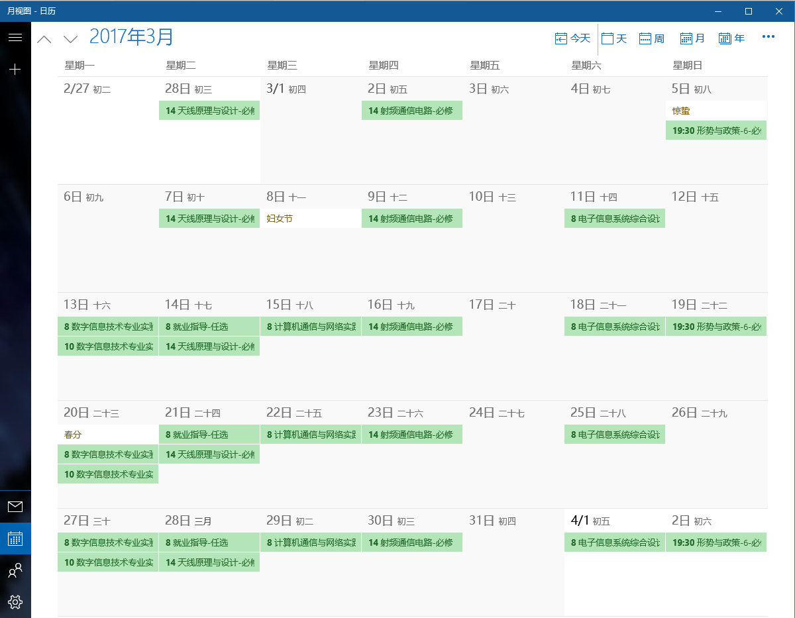

四川大学课程表转日历工具
====

- 简单的转换工具
- ics文件在win8/win10有自带的应用可以直接打开
- 可以导入到谷歌日历/outlook/icloud
- 手机可以通过同步的方式导入，部分手机有直接导入ical文件的功能
- 安卓手机还可以使用ical import 本地导入[play](https://play.google.com/store/apps/details?id=tk.drlue.icalimportexport)

### Win10截图

### 手机截图
